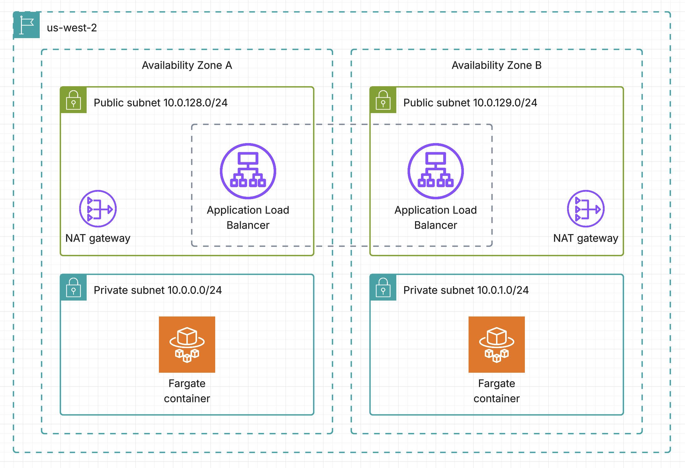

# novi-labs-devops-assignment

[https://www.novi-labs.infra.rnoel.net](https://www.novi-labs.infra.rnoel.net)

## Architecture overview



## CI/CD pipeline

[Github Actions pipeline](https://github.com/remijnoel/novi-labs-devops-assignment/actions)

Use dev branch to deploy to dev environment.

## First deployment (initial setup)

```shell
terraform init
terraform apply -target aws_route53_zone.novi_labs
# Once the DNS zone is created, you can add the NS records to the proper parent zone
terraform apply
```
